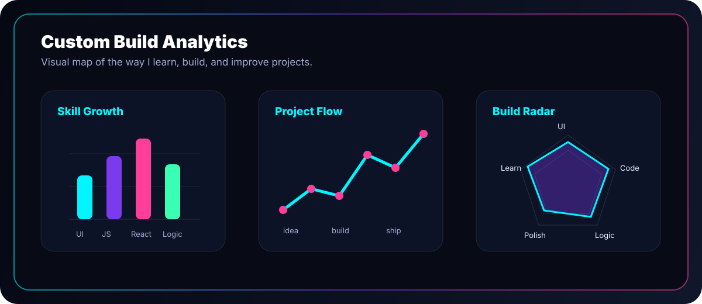

 

 

<table>
  <tr>
    <td width="58%" valign="top">
      <h2>Control Room</h2>
      

        I am <strong>Anurag Sonawane</strong>, a developer who likes building clean,
        useful, and visually sharp digital experiences.
      

      

        My profile is a live dashboard of what I am learning, building, improving,
        and shipping. I care about strong UI, practical code, and projects that feel
        finished instead of just functional.
      

    </td>
    <td width="42%" valign="top">
      <h2>Current Signal</h2>
      
<strong>Mode:</strong> learning, building, polishing

      
<strong>Focus:</strong> frontend, full-stack basics, clean UI

      
<strong>Goal:</strong> ship better projects with every commit

      
<strong>Contact:</strong> anuragsonawane2006@gmail.com

    </td>
  </tr>
</table>

 

## Live GitHub Graphs

 
 

 

<table>
  <tr>
    <td width="50%" valign="top">
      
    </td>
    <td width="50%" valign="top">
      
    </td>
  </tr>
  <tr>
    <td width="50%" valign="top">
      
    </td>
    <td width="50%" valign="top">
      
    </td>
  </tr>
</table>

 

## Trophy Board

 

 

## Tech Stack

 

<table>
  <tr>
    <td width="25%" align="center">
      <h3>Think</h3>
      
Understand the problem and the people using the project.

    </td>
    <td width="25%" align="center">
      <h3>Design</h3>
      
Shape a UI that feels clean, clear, and easy to scan.

    </td>
    <td width="25%" align="center">
      <h3>Build</h3>
      
Turn the plan into working code with steady improvements.

    </td>
    <td width="25%" align="center">
      <h3>Polish</h3>
      
Refine the details until the project feels complete.

    </td>
  </tr>
</table>

 

## Contribution Flow

<picture>
  <source media="(prefers-color-scheme: dark)" srcset="https://raw.githubusercontent.com/Anurag-Sonawane/Anurag-Sonawane/output/github-contribution-grid-snake-dark.svg" />
  <source media="(prefers-color-scheme: light)" srcset="https://raw.githubusercontent.com/Anurag-Sonawane/Anurag-Sonawane/output/github-contribution-grid-snake.svg" />
  
</picture>

 
 

