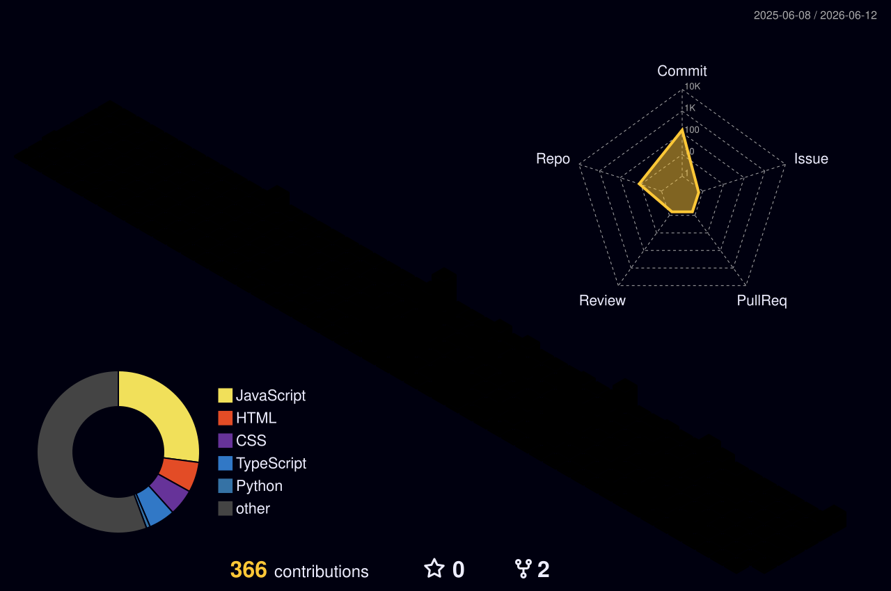

# Hi, I'm Anurag Sonawane

### Developer focused on clean UI, useful projects, and consistent progress.

---

## Contribution Graph

 
 

 
 

<picture>
  <source media="(prefers-color-scheme: dark)" srcset="https://raw.githubusercontent.com/Anurag-Sonawane/Anurag-Sonawane/output/github-contribution-grid-snake-dark.svg" />
  <source media="(prefers-color-scheme: light)" srcset="https://raw.githubusercontent.com/Anurag-Sonawane/Anurag-Sonawane/output/github-contribution-grid-snake.svg" />
  
</picture>

---

<table>
  <tr>
    <td width="55%" valign="top">
      <h2>About Me</h2>
      

        I build web projects with a focus on clean interfaces, practical logic,
        and a smooth user experience.
      

      

        I am currently improving my frontend and full-stack skills by learning,
        building, refining, and shipping projects consistently.
      

    </td>
    <td width="45%" valign="top">
      <h2>Current Focus</h2>
      
<strong>Learning:</strong> modern web development

      
<strong>Building:</strong> portfolio-ready projects

      
<strong>Improving:</strong> UI, code quality, and consistency

      
<strong>Goal:</strong> make every repo worth opening

    </td>
  </tr>
</table>

---

## GitHub Stats

<table>
  <tr>
    <td width="50%" valign="top">
      
    </td>
    <td width="50%" valign="top">
      
    </td>
  </tr>
  <tr>
    <td width="50%" valign="top">
      
    </td>
    <td width="50%" valign="top">
      
    </td>
  </tr>
</table>

---

## Tech Stack

 
 

---

### Thanks for visiting my profile.

Learning in public. Building consistently. Improving one commit at a time.

