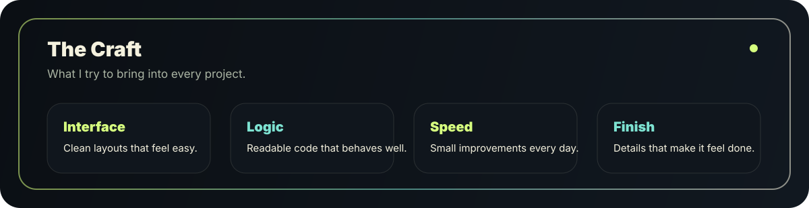

 

 

<table>
  <tr>
    <td width="60%" valign="top">
      <h2>About Me</h2>
      

        I am <strong>Anurag Sonawane</strong>, a developer who enjoys turning ideas
        into clean, useful, and visually polished digital experiences.
      

      

        I care about interface quality, readable code, practical problem solving,
        and building projects that feel complete.
      

    </td>
    <td width="40%" valign="top">
      <h2>Now</h2>
      
<strong>Learning:</strong> modern web development

      
<strong>Building:</strong> portfolio-ready projects

      
<strong>Improving:</strong> UI, logic, and consistency

      
<strong>Mindset:</strong> ship, learn, refine

    </td>
  </tr>
</table>

 

 

## GitHub Pulse

 

<table>
  <tr>
    <td width="50%" valign="top">
      
    </td>
    <td width="50%" valign="top">
      
    </td>
  </tr>
  <tr>
    <td width="50%" valign="top">
      
    </td>
    <td width="50%" valign="top">
      
    </td>
  </tr>
</table>

 

## Tools I Use

 

## Recognition Board

 

<table>
  <tr>
    <td width="25%" align="center">
      <h3>Plan</h3>
      
Understand what needs to be built.

    </td>
    <td width="25%" align="center">
      <h3>Design</h3>
      
Make the experience clear and polished.

    </td>
    <td width="25%" align="center">
      <h3>Develop</h3>
      
Write practical code that works.

    </td>
    <td width="25%" align="center">
      <h3>Refine</h3>
      
Improve the small details that matter.

    </td>
  </tr>
</table>

 

<picture>
  <source media="(prefers-color-scheme: dark)" srcset="https://raw.githubusercontent.com/Anurag-Sonawane/Anurag-Sonawane/output/github-contribution-grid-snake-dark.svg" />
  <source media="(prefers-color-scheme: light)" srcset="https://raw.githubusercontent.com/Anurag-Sonawane/Anurag-Sonawane/output/github-contribution-grid-snake.svg" />
  
</picture>

 
 

