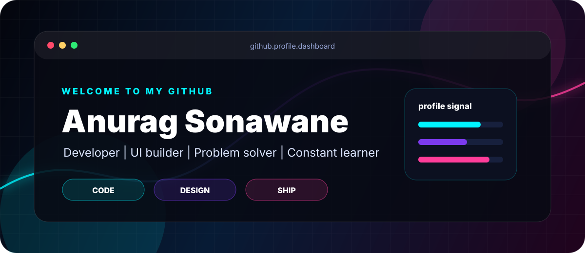
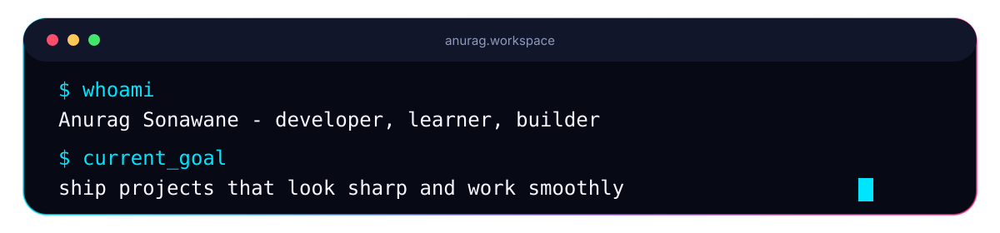

 

<table>
  <tr>
    <td width="55%" valign="top">
      <h2>About</h2>
      

        I am <strong>Anurag Sonawane</strong>, a developer focused on building clean,
        useful, and visually polished digital experiences.
      

      

        I like learning by shipping: taking an idea, building the first version,
        improving the details, and making the final result feel smooth.
      

    </td>
    <td width="45%" valign="top">
      <h2>Focus</h2>
      

        Frontend craft, practical problem solving, full-stack learning, clean UI,
        automation, and projects that make people stop scrolling.
      

      

        Current mode: learning deeply, building consistently, and improving with every commit.
      

    </td>
  </tr>
</table>

 

 

## Toolkit

 

<table>
  <tr>
    <td width="50%" valign="top">
      
    </td>
    <td width="50%" valign="top">
      
    </td>
  </tr>
</table>

 

## Build Pattern

<table>
  <tr>
    <td width="25%" align="center">
      <strong>Think</strong>
       
      Understand the idea and the user.
    </td>
    <td width="25%" align="center">
      <strong>Design</strong>
       
      Shape the interface and flow.
    </td>
    <td width="25%" align="center">
      <strong>Code</strong>
       
      Build it cleanly and make it work.
    </td>
    <td width="25%" align="center">
      <strong>Polish</strong>
       
      Improve details until it feels right.
    </td>
  </tr>
</table>

 

<picture>
  <source media="(prefers-color-scheme: dark)" srcset="https://raw.githubusercontent.com/Anurag-Sonawane/Anurag-Sonawane/output/github-contribution-grid-snake-dark.svg" />
  <source media="(prefers-color-scheme: light)" srcset="https://raw.githubusercontent.com/Anurag-Sonawane/Anurag-Sonawane/output/github-contribution-grid-snake.svg" />
  
</picture>

 
 

