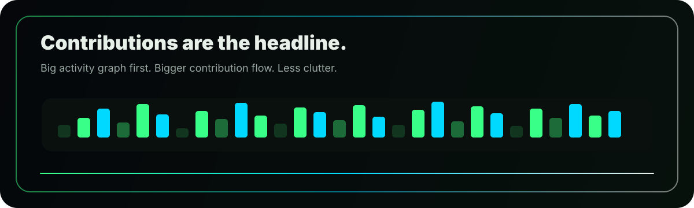
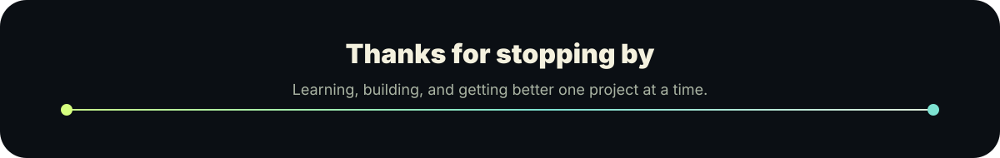

 

 

## Contribution Wall

 
 

 
 

 
 

<picture>
  <source media="(prefers-color-scheme: dark)" srcset="https://raw.githubusercontent.com/Anurag-Sonawane/Anurag-Sonawane/output/github-contribution-grid-snake-dark.svg" />
  <source media="(prefers-color-scheme: light)" srcset="https://raw.githubusercontent.com/Anurag-Sonawane/Anurag-Sonawane/output/github-contribution-grid-snake.svg" />
  
</picture>

 

<table>
  <tr>
    <td width="62%" valign="top">
      <h2>Who I Am</h2>
      

        I am <strong>Anurag Sonawane</strong>, a developer focused on clean interfaces,
        practical code, and projects that look polished when people open them.
      

      

        I like building in public, improving with every commit, and turning small ideas
        into portfolio-ready work.
      

    </td>
    <td width="38%" valign="top">
      <h2>Current Mode</h2>
      
<strong>Building:</strong> better web projects

      
<strong>Learning:</strong> frontend and full-stack development

      
<strong>Improving:</strong> UI, logic, consistency

      
<strong>Goal:</strong> make every repo worth opening

    </td>
  </tr>
</table>

 

## Performance Board

<table>
  <tr>
    <td width="50%" valign="top">
      
    </td>
    <td width="50%" valign="top">
      
    </td>
  </tr>
  <tr>
    <td width="50%" valign="top">
      
    </td>
    <td width="50%" valign="top">
      
    </td>
  </tr>
</table>

 

## Stack

 
 

 

<table>
  <tr>
    <td width="25%" align="center">
      <h3>01</h3>
      <strong>Think</strong>
      
Understand the idea clearly.

    </td>
    <td width="25%" align="center">
      <h3>02</h3>
      <strong>Build</strong>
      
Make the first useful version.

    </td>
    <td width="25%" align="center">
      <h3>03</h3>
      <strong>Improve</strong>
      
Clean the UI and code.

    </td>
    <td width="25%" align="center">
      <h3>04</h3>
      <strong>Ship</strong>
      
Finish strong and keep learning.

    </td>
  </tr>
</table>

 

