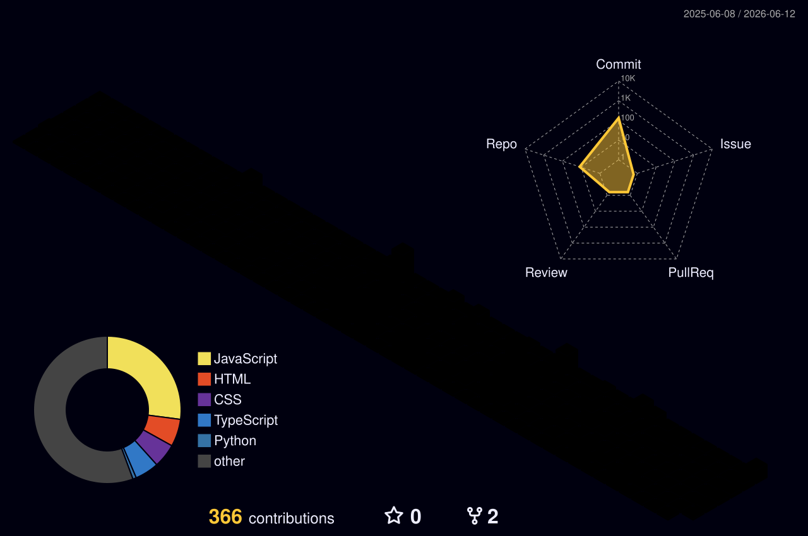

# Hi, I'm Anurag 👋

I’m a developer who enjoys turning ideas into clean, useful web experiences. I’m learning by building, refining, and sharing projects—one thoughtful iteration at a time.

---

## What I’m focused on

- Building polished, practical web projects
- Strengthening my frontend and full-stack fundamentals
- Improving usability, code quality, and the details that make a project feel complete

## Tools I work with

## GitHub at a glance

Contribution activity

---

Thanks for stopping by. Feel free to explore my repositories or say hello.

📫 **[Email me](mailto:anuragsonawane2006@gmail.com)** · **[Browse my projects](https://github.com/Anurag-Sonawane?tab=repositories)**
